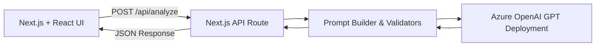
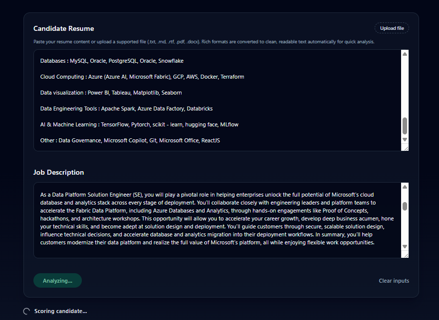
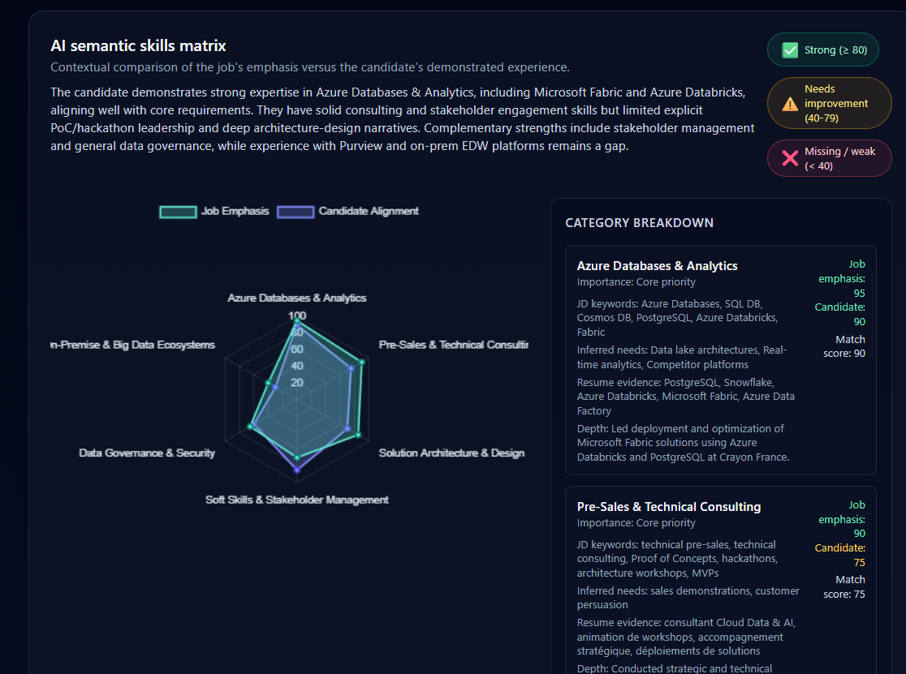
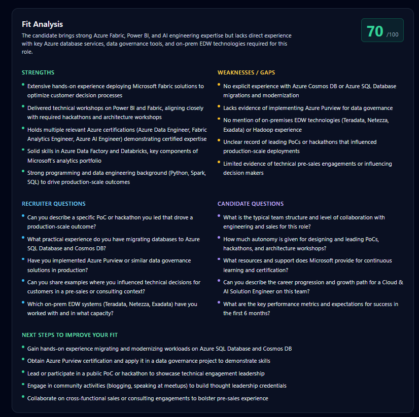

# SmartRecruit: AI-Powered Resume & Job Fit Scoring

[](https://github.com/your-username/SmartRecruit-AI-Powered-Resume-Job-Fit-Scoring/actions)
[](https://nextjs.org/)
[](https://www.typescriptlang.org/)
[](LICENSE)

## 📌 Project Overview
SmartRecruit is a Next.js application that compares a candidate's resume against a target job description using Azure OpenAI. It generates an explainable fit score plus guided recommendations so recruiters and candidates can take immediate action. The project showcases production-ready full-stack patterns for AI-assisted talent intelligence.

## 💡 Key Features & Use Cases
- **Skills & Evidence Matrix** – Map resume content to role requirements and quantify alignment with a 0–100 fit score.
- **AI-Powered Insight Cards** – Surface strengths, weaknesses, and tailored improvement steps generated by Azure OpenAI.
- **Interview Prep Toolkit** – Provide recruiter-facing and candidate-facing questions to accelerate screening conversations.
- **Real-World Use Case:** Recruiters paste a new job description and candidate resume to quickly understand hiring fit and gaps before scheduling interviews.
- **Real-World Use Case:** Candidates analyze their resume against a job post to decide what to emphasize or update before applying.

## 🧭 Project Architecture & Tech Stack


**Frontend**: Next.js 14, React 18, Tailwind CSS, TypeScript 5.4  
**Backend**: Next.js API Routes, Fetch API, structured JSON parsing  
**AI Layer**: Azure OpenAI Chat Completions (`gpt-4o` / `gpt-4o-mini` deployments)  
**Tooling**: ESLint, PostCSS, npm scripts for build/test, Vercel-ready deployment

## 🚀 Quick Start – Installation & Commands
```bash
# 1️⃣ Clone the repository
git clone https://github.com/your-username/SmartRecruit-AI-Powered-Resume-Job-Fit-Scoring.git
cd SmartRecruit-AI-Powered-Resume-Job-Fit-Scoring

# 2️⃣ Install dependencies
npm install

# 3️⃣ Create the environment variables template
cp .env.local.example .env.local

# 4️⃣ Open the .env.local file and fill in required keys
# (see list below for descriptions)

# 5️⃣ Run the project in development mode
npm run dev

# 6️⃣ Build for production
npm run build
npm start
```
> ℹ️ Docker images are not yet provided. Add a `Dockerfile` or `docker-compose.yml` if you plan to containerize the app.

## 📁 Environment Variables (`.env.local`)
| Variable | Required | Description |
| --- | --- | --- |
| `AZURE_OPENAI_ENDPOINT` | ✅ | Base URL of your Azure OpenAI resource (e.g., `https://my-resource.openai.azure.com`). |
| `AZURE_OPENAI_KEY` | ✅ | API key with access to the deployment. |
| `AZURE_OPENAI_DEPLOYMENT` | ✅ | Name of the deployed chat model (e.g., `gpt-4o-mini`). |
| `AZURE_OPENAI_API_VERSION` | ➕ Optional | Override the default API version (`2024-02-15-preview`). |

## 📸 Screenshots / Demo
> Replace the image paths below with your actual screenshots or GIFs located in `docs/screenshots/`.

  
*Candidate uploads a resume or pastes raw text alongside a job description.*

  
*Azure OpenAI returns a radar-style alignment across core skill categories.*

  
*Interactive dashboard displaying fit score, strengths, and weaknesses.*


## 🧪 How It Works (Step-by-Step)
1. **Resume & Job Intake** – Users paste or upload text into the Next.js interface with instant validation feedback.
2. **Data Normalization** – The API route trims input, enforces schema, and prepares a structured prompt.
3. **AI Reasoning** – Azure OpenAI evaluates overlap between resume evidence and job requirements, producing JSON aligned to the enforced schema.
4. **Post-Processing** – The server validates the JSON, clamps scores (0–100), and normalizes text arrays for consistency.
5. **Visualization** – The frontend renders fit score cards, strengths/weakness lists, and interview question buckets.
6. **Actionable Output** – Users can copy recommendations, export JSON, or persist the data (ready for ATS or dashboards).


## 📚 Additional Resources
- `docs/architecture.md` – Extended system architecture, deployment considerations, and roadmap ideas.
- `docs/api-and-prompts.md` – Prompt design and API payload details.
- `docs/feature-roadmap.md` – Planned enhancements for future iterations.

---
Made with ❤️ to help recruiters and candidates make smarter hiring decisions faster.
